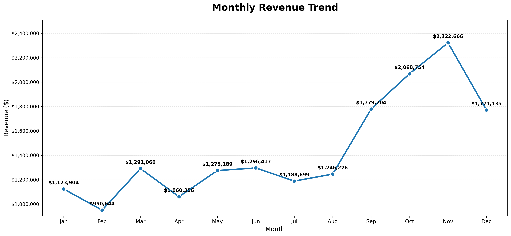
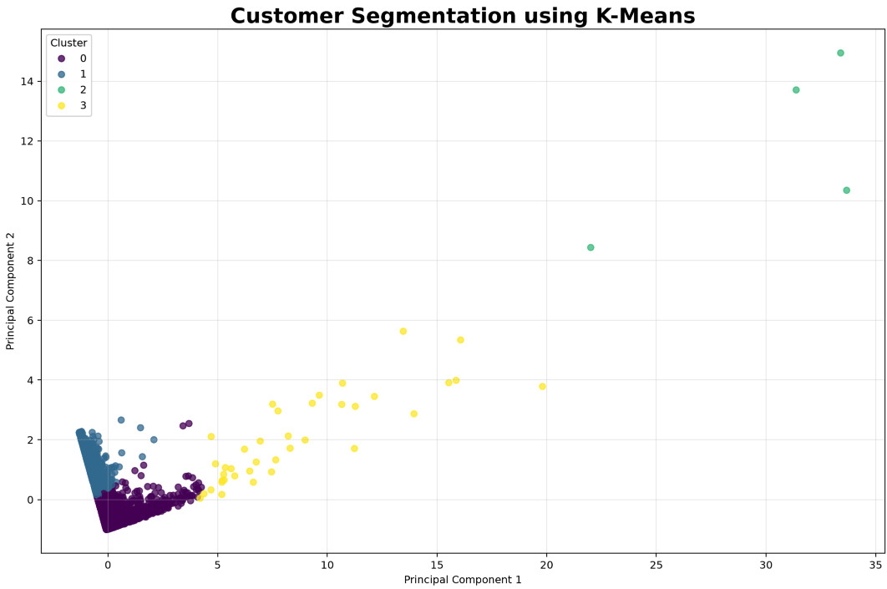
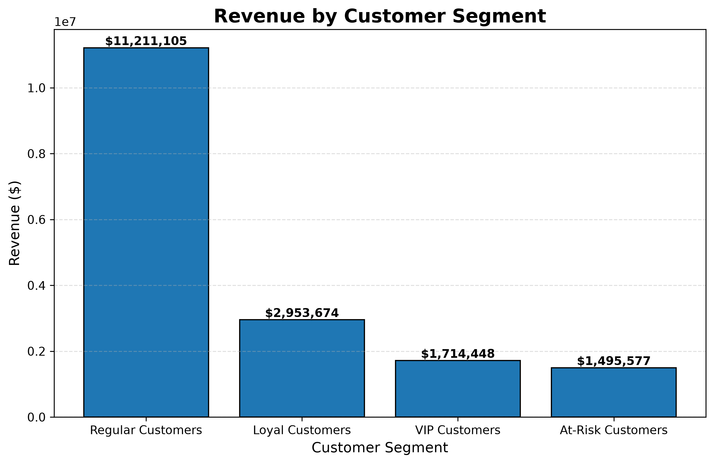

# 📊 Online Retail Analytics

## End-to-End Data Analytics & Customer Segmentation Project

This project demonstrates a complete end-to-end data analytics workflow using the **Online Retail II** dataset. It transforms over **1 million retail transactions** into actionable business insights through data cleaning, exploratory data analysis (EDA), visualization, customer segmentation, and machine learning.

---

## 📌 Project Objectives

- Clean and preprocess raw retail transaction data
- Perform exploratory data analysis (EDA)
- Identify sales and customer behavior trends
- Analyze product and country performance
- Perform RFM Analysis
- Segment customers using K-Means Clustering
- Generate business recommendations

---

# 📂 Dataset

- **Dataset:** Online Retail II
- **Rows:** 1,048,576
- **Type:** Retail Transactions
- **Source:** Kaggle / UCI Machine Learning Repository

---

# 🛠 Technologies Used

- Python
- Pandas
- NumPy
- Matplotlib
- Scikit-learn
- Jupyter Notebook

---

# 📁 Project Structure

```text
Online-Retail-Analytics/

├── data/
│   ├── raw/
│   └── processed/
│
├── notebooks/
│   ├── 01_Data_Loading.ipynb
│   ├── 02_Data_Cleaning.ipynb
│   ├── 03_EDA.ipynb
│   ├── 04_Data_Visualization.ipynb
│   ├── 05_RFM_Analysis.ipynb
│   └── 06_Customer_Segmentation.ipynb
│
├── reports/
│   └── figures/
│
├── src/
│
├── README.md
├── requirements.txt
├── LICENSE
└── .gitignore
```

---

# 📈 Project Workflow

- Data Loading
- Data Cleaning
- Feature Engineering
- Exploratory Data Analysis
- Professional Data Visualization
- RFM Analysis
- Customer Segmentation
- K-Means Clustering
- PCA Visualization
- Business Recommendations

---

# 📊 Key Visualizations

## Monthly Revenue Trend



---

## Top 10 Countries by Revenue


---

## Top 10 Products by Revenue


---

## Revenue by Weekday


---

## Customer Segmentation using K-Means



---

## Revenue by Customer Segment



---

# 🤖 Machine Learning

The project applies **K-Means Clustering** to segment customers based on the RFM framework.

Features used:

- Recency
- Frequency
- Monetary Value

Principal Component Analysis (PCA) is used to visualize customer clusters in two dimensions.

---

# 💡 Business Insights

- VIP customers generate the highest revenue.
- Loyal customers purchase frequently and should receive loyalty rewards.
- Regular customers have growth potential through targeted marketing.
- At-risk customers should be targeted with retention campaigns.
- Revenue peaks during the final quarter of the year, indicating strong seasonal demand.

---

# 🚀 How to Run

Clone the repository

```bash
git clone https://github.com/Mohamed-Abdirashid-tech/online-retail-analytics.git
```

Move into the project folder

```bash
cd online-retail-analytics
```

Create a virtual environment

```bash
python -m venv .venv
```

Activate it

Windows

```bash
.venv\Scripts\activate
```

Install dependencies

```bash
pip install -r requirements.txt
```

Launch JupyterLab

```bash
jupyter lab
```

---

# 📄 License

This project is licensed under the MIT License.

---

# 👤 Author

**Mohamed Abdirashid Mohamud**

**Data & Business Intelligence Analyst**

Python • SQL • Machine Learning • Business Analytics